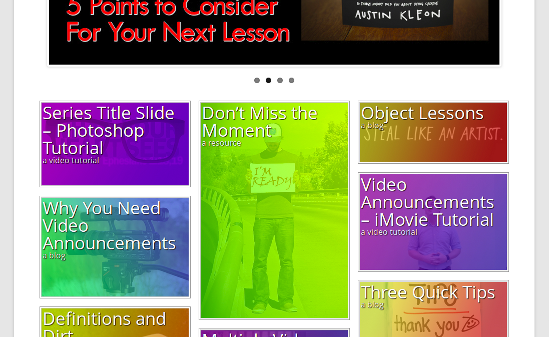

wordpress-fallingpolygons
https://github.com/korylprince/wordpress-fallingpolygons

A simple wordpress theme based on twentytwelve.

See it in action at http://7minutefix.com/ .

#Installing#

Requires Wordpress TwentyTwelve theme.

Copy the folder to your wp-content/themes folder.

Optionally install the [Flexslider Plugin](https://github.com/korylprince/wordpress-flexslider) to use on the front page.

Optionally install the [Infinite-Scroll Plugin](http://wordpress.org/extend/plugins/infinite-scroll/) for fun.

Use the following settings for Infinite-Scroll:

    Content Selector: #postholder
    Navigation Selector: #nav-wrapper
    Next Selector: #nav-wrapper a
    Item Selector: .post-wrapper
    Callback: updateMasonry();
    Behavior: Masonry/Isotope

If you have any issues or questions, email the email address below, or open an issue at:
https://github.com/korylprince/wordpress-fallingpolygons/issues

#Features#

All pages that show groups of posts use tiles based on the featured image.

There are two post types - Standard, and Image. Image shows the featured image on the single post page and Standard does not.

There is an extra metabox for adding a subtitle to each post or page.

Users can enter their twitter to show along with their name.

Includes a hack to make reCAPTCHA more responsive.

Fixes video scaling.

#Copyright Information#

Wordpress code is copyright its owner.

All other code is Copyright 2013 Kory Prince (korylprince at gmail dot com.) This code is licensed under the GPL v2 which is included in this distribution. If you'd like it licensed under another license then send me an email.

This program is free software: you can redistribute it and/or modify
it under the terms of the GNU General Public License as published by
the Free Software Foundation, either version 2 of the License, or
(at your option) any later version.

This program is distributed in the hope that it will be useful,
but WITHOUT ANY WARRANTY; without even the implied warranty of
MERCHANTABILITY or FITNESS FOR A PARTICULAR PURPOSE.  See the
GNU General Public License for more details.

You should have received a copy of the GNU General Public License
along with this program.  If not, see <http://www.gnu.org/licenses/>.
